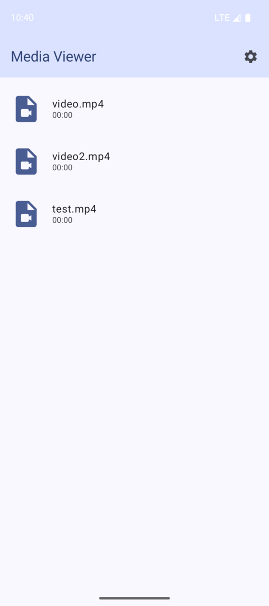
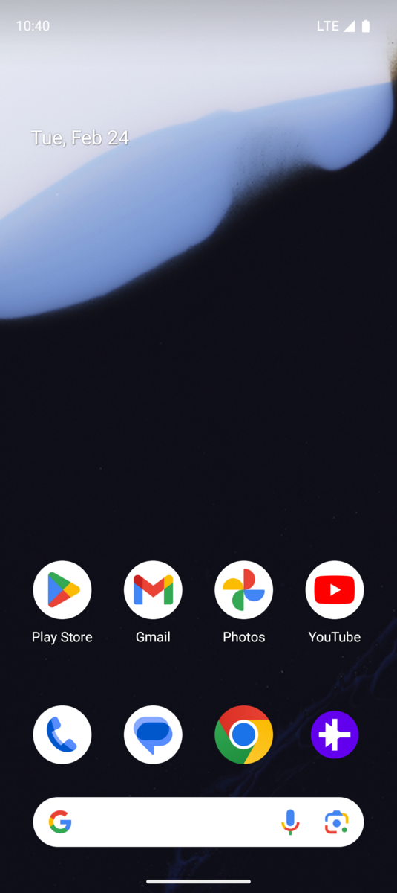

# Media Viewer

A simple Android application for viewing video files from a user-selected folder, with PIN-protected settings.

## Features

- **Video Library**: Browse and play video files from any folder on your device
- **PIN Security**: Protect access to settings with a 4-digit PIN
- **Folder Selection**: Use Android's Storage Access Framework to select any folder
- **Full-Screen Playback**: Tap on any video to play it in full-screen mode
- **Modern UI**: Built with Jetpack Compose and Material Design 3

## Quick Start

1. **First Launch**: Set a 4-digit PIN to protect settings
2. **Main Screen**: View videos from selected folder
3. **Settings**: Tap the gear icon to access settings (requires PIN)
4. **Select Folder**: Choose a folder containing videos
5. **Play Video**: Tap any video to play in full-screen

## Requirements

- Android API 26+ (Android 8.0 Oreo)
- Android SDK 35
- Java 17

## Screenshots

| Screen | Description |
|--------|-------------|
|  | PIN entry screen - required to access settings |
|  | Main video library - browse and play videos |
|  | Home screen with no folder selected |
